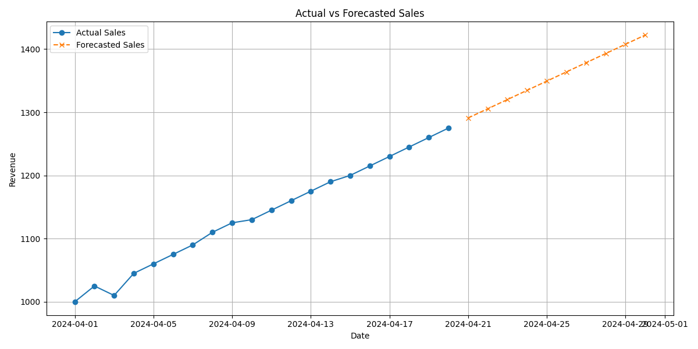

Sales Forecasting with Linear Regression
========================================

This project demonstrates a simple sales forecasting model using Python libraries like pandas, matplotlib, and scikit-learn.

Overview
--------
- Reads sales data from 'sales_data.csv'
- Handles missing values and converts dates to numerical format
- Trains a Linear Regression model on past sales revenue
- Predicts sales revenue for the next 10 days
- Visualizes actual and forecasted sales using a line chart

Dataset Format
--------------
Expected columns in sales_data.csv:
- date (e.g., 2024-04-01)
- product (optional)
- quantity (optional)
- revenue (e.g., 1000)

Requirements
------------
- pandas
- matplotlib
- scikit-learn

Install dependencies with the following command:

    pip install pandas matplotlib scikit-learn

Running the Script
------------------
Ensure 'sales_data.csv' is in the same folder as the script. Then run the Python script using:

    python sales_forecasting.py

Outputs
-------
- Console: Mean Squared Error and forecast table for the next 10 days
- Image file: 'screenshort.png' showing the actual vs forecasted revenue over time

Screen Short
-------------

